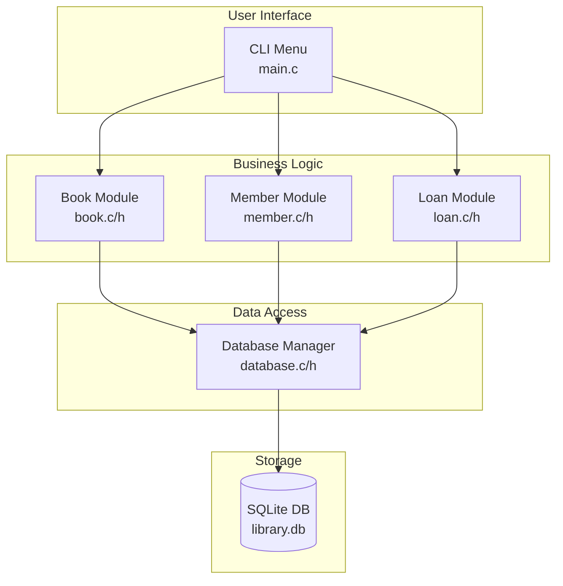
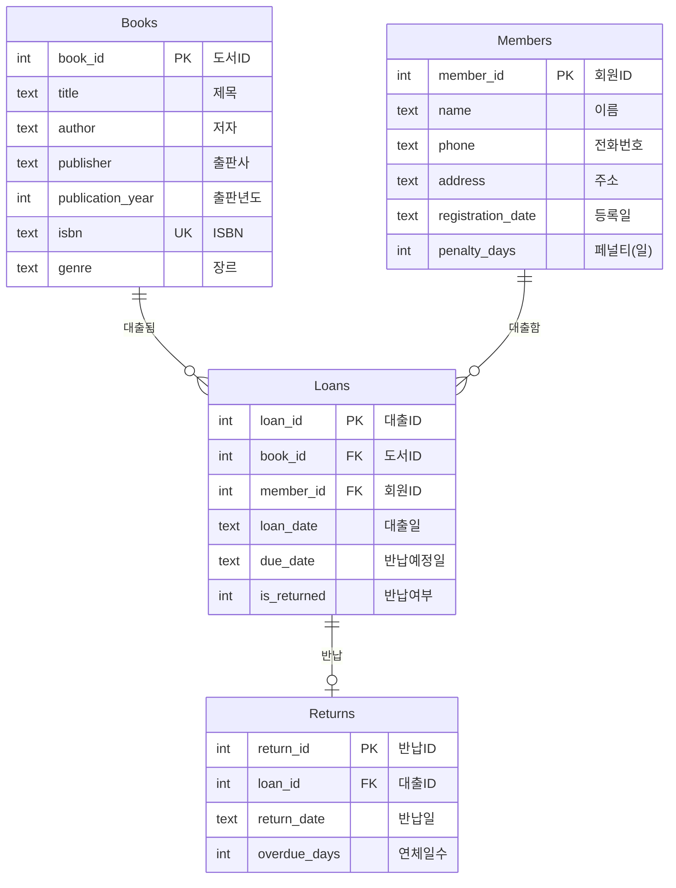
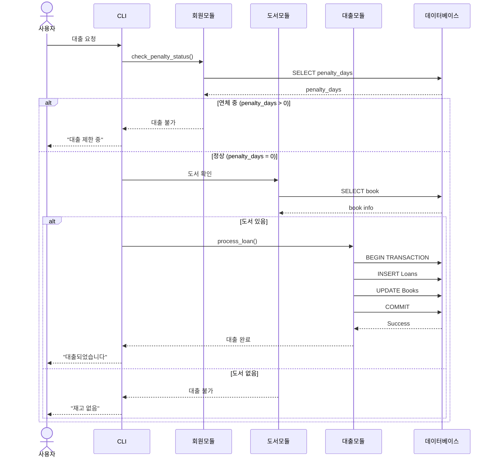
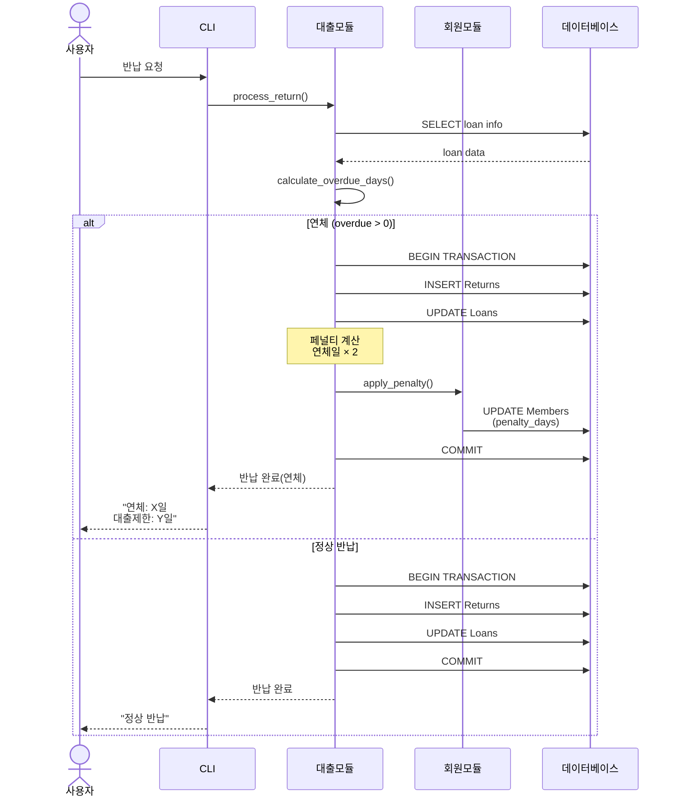
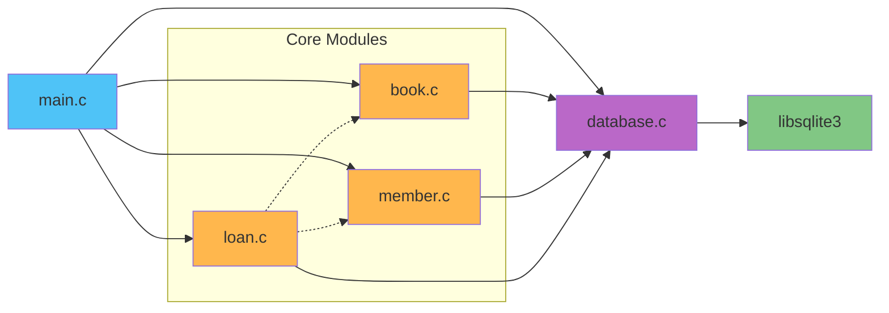
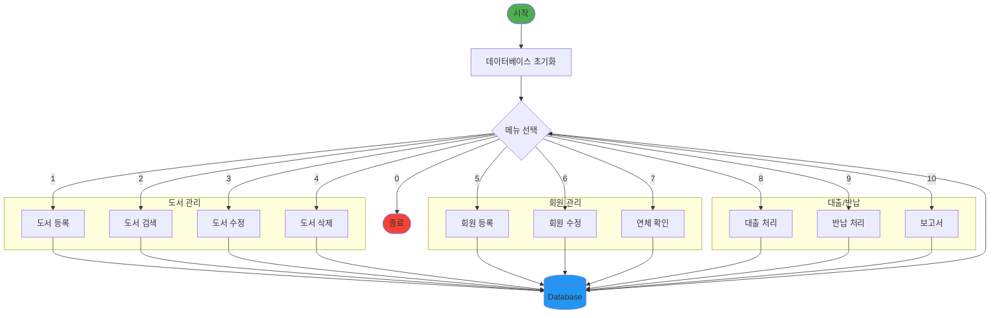
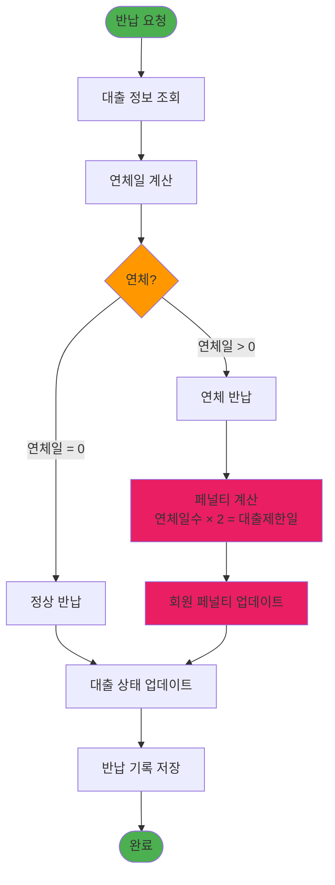
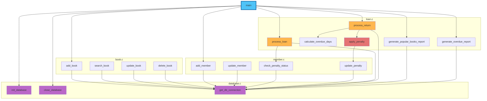
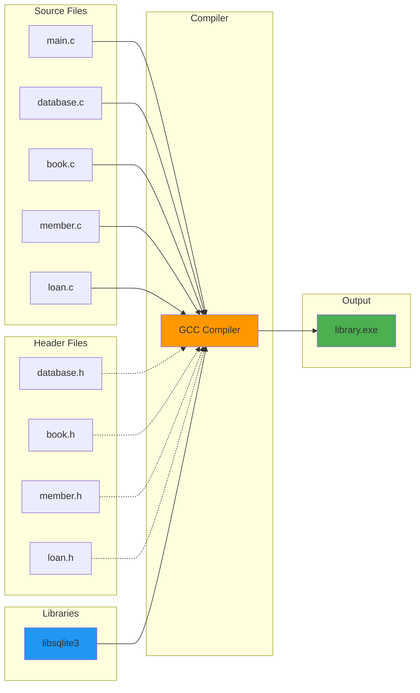

# 작은 도서관 시스템 - 프로젝트 다이어그램

## 📊 1. 시스템 아키텍처



## 🗄️ 2. 데이터베이스 ERD



## 🔄 3. 대출 프로세스 시퀀스



## 📤 4. 반납 및 연체 처리



## 📁 5. 파일 구조

```
task03/
│
├── 📂 .vscode/              VS Code 설정
│   ├── settings.json        Copilot 지침 설정
│   ├── tasks.json           빌드 태스크
│   ├── launch.json          디버깅 설정
│   └── c_cpp_properties.json C/C++ 설정
│
├── 📂 include/              헤더 파일
│   ├── database.h           DB 연결 인터페이스
│   ├── book.h               도서 관리 인터페이스
│   ├── member.h             회원 관리 인터페이스
│   └── loan.h               대출/반납 인터페이스
│
├── 📂 src/                  소스 파일
│   ├── main.c               메인 프로그램
│   ├── database.c           DB 초기화 및 연결
│   ├── book.c               도서 CRUD 구현
│   ├── member.c             회원 관리 구현
│   └── loan.c               대출/반납 로직
│
├── 📂 database/             데이터베이스
│   ├── library.db           SQLite DB 파일
│   └── init_db.sql          테이블 생성 스크립트
│
├── 📂 tests/                테스트
│   └── test_main.cpp        Google Test 테스트
│
├── 📂 bin/                  실행 파일
│   └── library.exe          컴파일된 실행 파일
│
├── 📂 docs/                 문서
│   ├── spec.md              프로젝트 명세
│   ├── C-style.md           코딩 스타일 가이드
│   ├── database-style.md    DB 설계 가이드
│   └── test-style.md        테스트 가이드
│
└── 📂 diagrams/             다이어그램
    └── architecture.md      아키텍처 다이어그램
```

## 🔗 6. 모듈 의존성



## 📊 7. 데이터 흐름



## ⚠️ 8. 연체 관리 로직



## 🔧 9. 함수 호출 관계



## 🎯 10. 빌드 프로세스



---

## 📝 빌드 명령어

```bash
# 전체 프로젝트 빌드
gcc -o bin/library.exe \
    src/main.c \
    src/database.c \
    src/book.c \
    src/member.c \
    src/loan.c \
    -Iinclude \
    -lsqlite3 \
    -g -Wall

# 실행
./bin/library.exe
```

## 🧪 테스트 빌드

```bash
# Google Test 빌드
g++ -o bin/test_library.exe \
    tests/test_main.cpp \
    src/database.c \
    src/book.c \
    src/member.c \
    src/loan.c \
    -Iinclude \
    -lsqlite3 -lgtest -lgtest_main \
    -g

# 테스트 실행
./bin/test_library.exe
```
